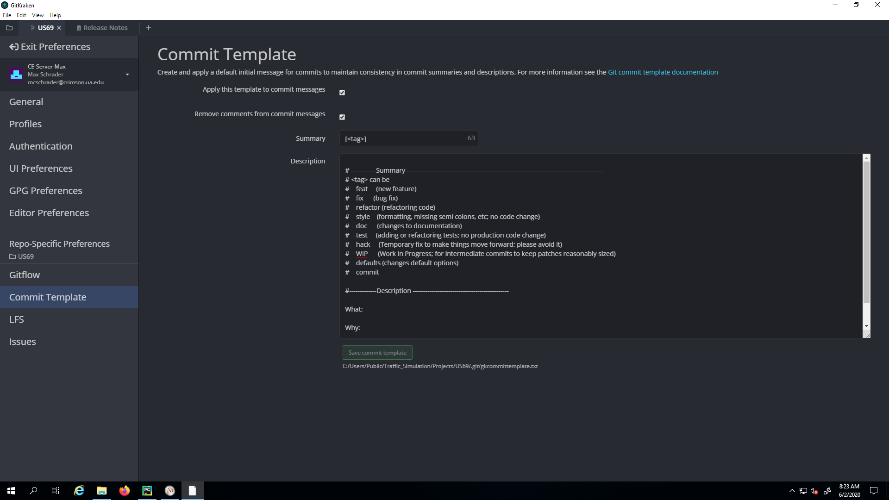

# Git Commit Template

The purpose of a Git commit template is to standardize the comments associated with a commit.

When multiple users are working on a project, it is important to convey to others what the commit entails,
and what the purpose is.

To add a commit template to your GitKraken, copy the contents of [.gkcommittemplate.txt](.gkcommittemplate.txt) into 
the GitKraken

Then navigate to **Preferences** in GitKraken and paste the contents into the text box like below. 

You are good to go! Now when making a commit, select a tag or tags that best describe your commit. 
Then type a short description in the header and elaborate on the what and the why in the description. 
Include your email in the sign-off.

